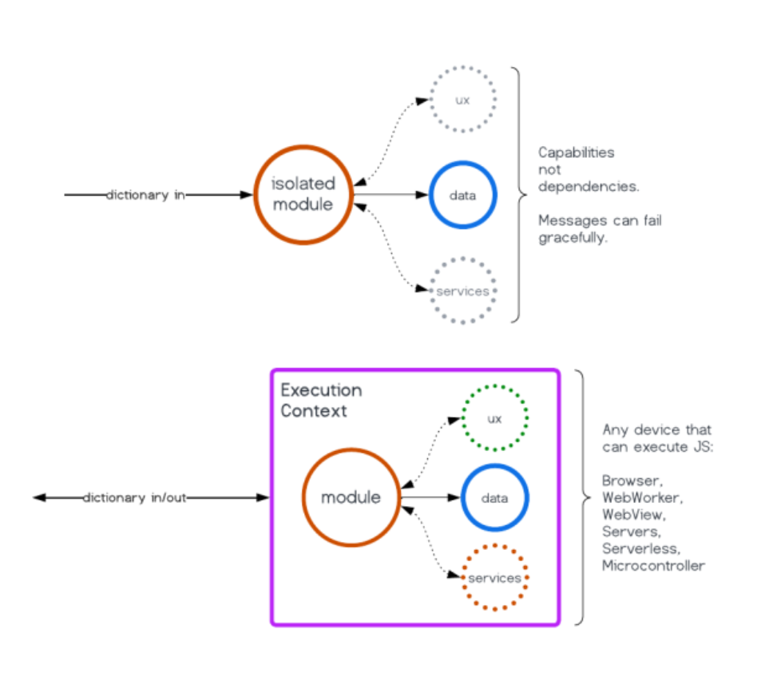
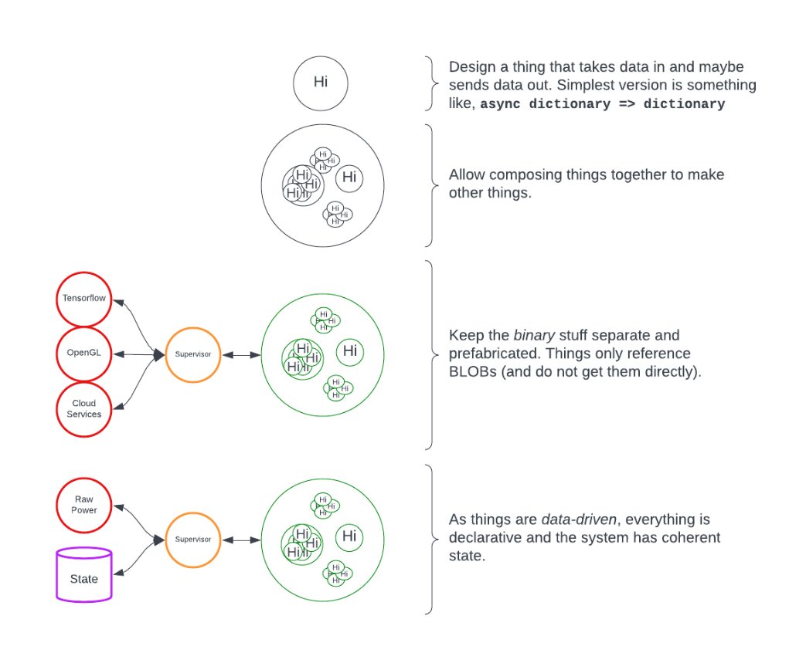
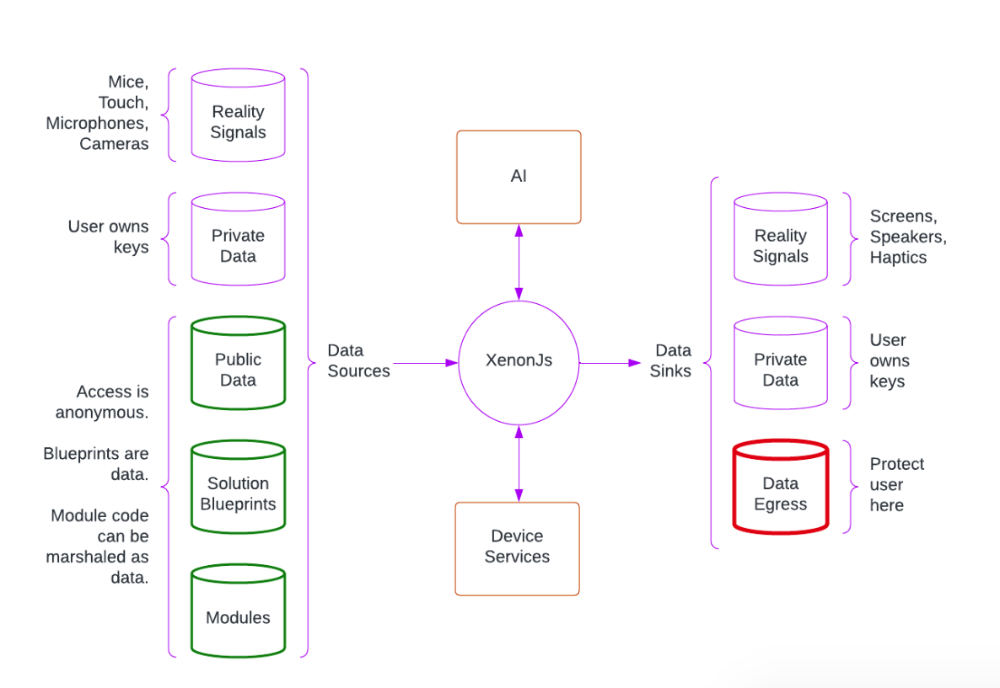

# XenonJs
XenonJs implements a user-sovereign, AI-powered, semantic framework, and an ecosystem of durable, interoperable components.

## Who and what is it good for?
Whether you are prototyping an experiment, or building a production ready customer facing product -  
XenonJs is suitable for you.

Whether you are building from scratch, or looking to expand functionality of an existing project -   
XenonJs is suitable for you.

Whether you are a software guru, or have no coding experience at all -  
XenonJs is suitable for you.

"A picture is worth a thousand words", but a video has 24 frames per second, so every one minute of a video is worth one million and fourty four hundreds of thousands of words. Watch our demos at: [XenonJs demos](https://www.youtube.com/watch?v=2cdu7H4v3s0&list=PLJFylhBdojdclwfZ3sVukECTffulcPr8d&ab_channel=MariaKleiner).

## Getting started

XenonJs features 2 applications:
* [`Run`](https://xenon-js.web.app/0.5/Run/): an application that allows you to run any XenonJs experience (aka Graph) in a browser
* [`Build`](https://xenon-js.web.app/0.5/Build/): an web-based IDE that lets you compose XenonJs experiences (aka Graphs)

### Run Graphs

To get started, try using our demo XenonJs Graphs:  
* [Knowledge Space](https://xenon-js.web.app/0.5/Run/?graph=KnowledgeSpace)
* [Video effects](https://xenon-js.web.app/0.5/Run/?graph=VideoRain)
* [Image completion](https://xenon-js.web.app/0.5/Run/?graph=ImageCompletion)
* [Translation](https://xenon-js.web.app/0.5/Run/?graph=TranslateWithAudio)
* [Weather forecast](https://xenon-js.web.app/0.5/Run/?graph=LocalWeather)

More demo Graphs can be found on our website: [xenonjs.com](https://xenon-js.web.app/#demos)


### Build Graphs

You can also build your very own XenonJs Graphs from the collection of XenonJs Nodes:
* Try out the [Build](https://xenon-js.web.app/0.5/Build) IDE  
* Here is a guide on how to use it: [Build README](./pkg/Build/README.md)


#### Access the graphs:
The Graphs you compose in `Build` are immediately accessible in the `Run` application.

To run a specific graph, pass its name as URL parameter to the `Run` app:  
> [xenon-js.web.app/0.5/Run/?graph=GRAPH-NAME](https://xenon-js.web.app/0.5/Run/?graph=GRAPH-NAME)

By default the Graphs you construct in `Build` are persisted in your browser's local storage. You can access a locally stored Graph at:  
> [xenon-js.web.app/0.5/Run/?graph=local$GRAPH-NAME](https://xenon-js.web.app/0.5/Run/?graph=local$GRAPH-NAME)

### Graphs Library

Graphs are constructed from XenonJs Nodes or other Graphs. The XenonJs Nodes and Graphs form an emerging constantly growing ecosystem of components and you can easily compose graph from our off-the-shelf components.
More detailed information on the components is available at the [Library README](./pkg/Library/README.md).

### Custom libraries
`Build` also allows you to add your own custom and pluggable Nodes on the fly, and make them immediately usable in your Graphs. To get started, simply clone and tweak our [demo replit](https://replit.com/@sjmiles/CustomLibrary).  
Here you can find codelabs for authoring your own components: [Atoms](./pkg/Library/Atom.md), [Nodes](./pkg/Library/Node.md), and [Node Types](./pkg/Library/NodeType.md).

## Run XenonJs locally

It is also easy to run `Build` and `Run` locally:

Clone the repo:
```
git clone https://github.com/NeonFlan/xenonjs.git -b 0.5

cd xenonjs
```

*Note: `0.5` is our stable(-ish) version. We are constantly adding cool new features, and you are welcome to try ToT at your own risk :)*

At the very first time run:
```
npm install
```

You can use a webserver of your choice to access the local `Run` and `Build`, but for your convenience, we provide one with our repo. Run the webserver:
```
npm run serve
```

To access `Build` IDE in your browser go to:  
> [localhost:9871/Build](http://localhost:9871/Build)

To access `Run` application in your browser go to:  
> [localhost:9871/Run](http://localhost:9871/Run)

By default, the Graph that was last open in `Build` will be run. To choose a different graph, add a URL param:

> [localhost:9871/Run/?graph=local$GRAPH-NAME](http://localhost:9871/Run/?graph=local$GRAPH-NAME)

## Get in touch

We spend most of our time writing code and, unfortunately, this means that our documentation is incomplete or lags behind. We are working on it!  
  
In the meantime, if you have any questions, ideas or feedback, please, don't hesitate to reach out:
* either by filing an [GitHub issue](https://github.com/NeonFlan/xenonjs/issues/new) 
* or via email: [info@xenonjs.com](mailto:info@xenonjs.com).


## Overview

### In the Small

XenonJs is modular.

Components are simple, dependency-free, and designed to interoperate with current technology.
Components are composable, and compositions are composable. Re-use is first-class.
The low-cost of components make them applicable to a wide spectrum of tasks - from quick experiments or individual features, to complex and scalable applications or platforms.



### In the Large

XenonJs Graphs are solution blueprints.

Graphs are declarative and semantic: amenable to coherent reasoning by humans and LLMs.
Graphs leverage AI on multiple layers: for interpreting user-context and intention, composing modules into experiences, authoring new modules, and inside modules themselves for data processing and generation.



### Finally

Reality interfaces (cameras, screens, touch devices, speaker, mics, and so on) are decoupled from core computation, supporting federation of devices and execution contexts.
We allow for user's data to be available only via keys they hold.
Computation ideally occurs locally, and data egress is constrained.


