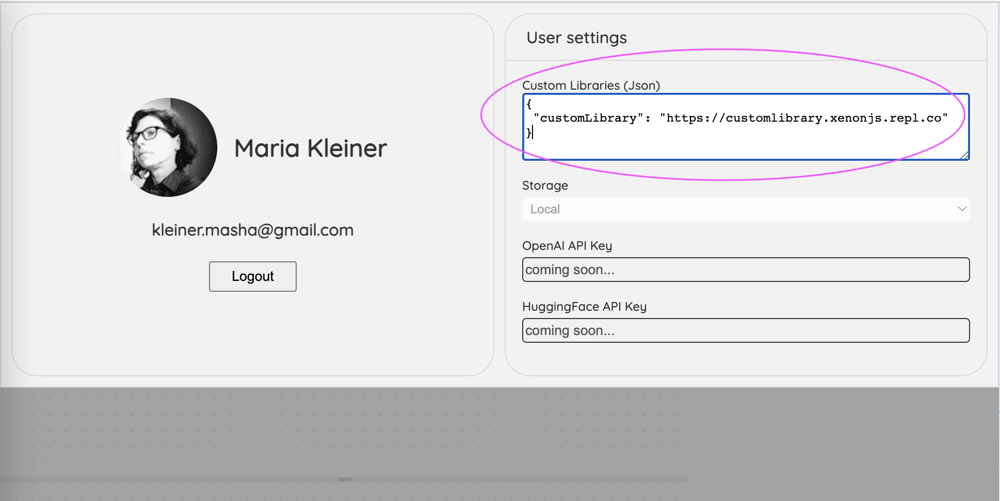

# XenonJs Build/ IDE

`Build/` is a tool for constructing XenonJs Graphs from the existing collection of Nodes.
We use `Build/` to construct all Graphs we make and use, including all demo Graphs.
With `Build/` you can create new experiences without writing a single line of code.

`Build/` is available for you at: [XenonJs/Build](https://xenon-js.web.app/0.3/NeonFlan/Apps/Build/)  
or you can run it locally, as described in [How to run XenonJs locally](../../README.md#local).

## How to

Build/ UI features the following:
* **Preview panel**: where you can see and interact with your Graph in realtime
* **Node Graph structure panel**: demonstrates how the Nodes in the Graph connect to each other
* **Individual Node Inspector panel**: let's you configure the data and layout of selected node
* **Rendering structure panel**: let's you view and re-arrange the UI rendering hierarchy

<i>Note: we require google-login so that Graphs that you create are annotated with your name. Our multi-user collaborative experience of sharing and co-editing graphs is in the works.</i>

### Here is a simple example of a "Hello world" Graph:

To read a more detailed `Build/` tutorial, please, take a look at [Build HowTo](https://docs.google.com/presentation/d/1UbfIxy5RaawlqpX4s04EUrB79Yoium-iYEkV1hk0IgA/edit#slide=id.p).

**Fun fact**: the Build/ app is a XenonJs [Graph](https://github.com/NeonFlan/xenonjs/blob/main/pkg/Graphs/Build.js), and can be edited inside itself!

### Node types
To add a new node, or to morph an existing one, you will select a node type:

The XenonJs engine supports running arbitrary Nodes (no compilation or registration steps involved). Today the UX supports selecting a Node type for the existing collection only.
If you would like to add custom Nodes, refer to this [sample PR](https://github.com/NeonFlan/xenonjs/pull/114), and read the Nodes types [readme](../Library/README.md).
  

## Custom Libraries
In `Build` you can easily add your own custom and pluggable Nodes on the fly.
Click the  icon at the top-right toolbar. The login/logout and user settings page will appear. In the screenshot below, our demo custom library is configured as an example:  

The easiest way to get started is to clone and tweak the [demo replit](https://replit.com/@XenonJs/CustomLibrary), and add it to your user settings.  

As soon as you add your library to the settings, it will become usable in your Graphs.
Our demo custom library contains a simple HelloWorld Atom and Node.
Here you can find detailed codelabs for authoring your own components: [Atoms](./pkg/Library/Atom.md), [Nodes](./pkg/Library/Node.md), and [Node Types](./pkg/Library/NodeType.md).

---
  
  
This documentation is incomplete (yet!). If you have any questions, ideas or feedback, please, don't hesitate to reach out, either by filing an [issue](https://github.com/NeonFlan/xenonjs/issues/new), joining our [discord](https://discord.gg/PFsHCJHJdN) or via email: [info@xenonjs.com](mailto:info@xenonjs.com).
