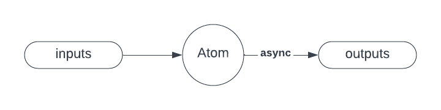

# Atoms

## Key concepts
Atom is data-driven.  
Atoms have no awareness of other atoms, system state, rendering surfaces etc.  

Atom receives `inputs` and emits `outputs`:

* Multiple inputs can be changed synchronously, and only one update will result.
* Changes that occur while a Particle is busy are accumulated until it is free.
* Outputs can be sent at any time.

## Atom API

### update

The `update` method is called when (1) inputs are dirty and (2) any previous call to update has resolved:

```
async update(inputs, state, tools) { … }
```

#### Parameters

`inputs`:  handles for stores that the Particle is binding to.

`state`:  an object that is limited to the scope of the current particle and can be changed and passed to sub-functions.
Depending on Particle configuration, state may or may not persist between calls to update.

`tools`: contain additional allowed capabilities granted to the particle, for example:  
  * `service`: an API to perform a service calls. Services are application dependent.  
  * `output`: an API to send immediate output (before returning).  
  * `isDirty`: an API to check whether a specific input has been changed.  

#### Return value
The returned object contains a map of values that cause updates to the inputs of the Atoms that are connected to this Atom.  
Returning `null` or `undefined` from an Atom is a no-op.

#### Examples
Simple example: 
```
update(inputs) { 
  return {upper: inputs.name?.toUpperCase?.()};
}
```

or with destructuring syntax:
```
update({name}) { 
  return {upper: name?.toUpperCase?.()};
}
```

Another example:
```
update({firstName, lastName}) {
  if (firstName && lastName) {
    return {
      greeting: `Hello! My name is ${lastName} ${firstName}`
    };
  }
}
```
The output is only sent if both names are valued. See also [shouldUpdate](#shouldupdate) helper function.

Example with an `output` call:
```
async update({inputValue}, state, {output, service}) {
  let outputValue = inputValue * 10;
  // send output synchronously
  output({outputValue});
  // do asynchronous work
  outputValue = await service({msg: 'mul10', data: {inputValue}});
  // send asynchronous output
  return {outputValue};
}
```

### shouldUpdate
#### Parameters
`inputs`: see inputs parameter in [update](#update).  
`state`: see state parameter in [update](#update).  

#### Return value
Returns a `boolean` to indicate whether `update` method is allowed to be called.

#### Example
```
async shouldUpdate({firstName, lastName}) {
  return Boolean(firstName && lastName);
},
async update({firstName, lastName}) {
  return {nameTag: `Hello! My name is ${lastName} ${firstName}`};
}
```

### template
In order to render UI the Atom should have a `template` property.
XenonJs currently supports DOM surface rendering, so the template will contain HTML-like content.
If you would like to use a different rendering surface, please, get in touch.

Static UI example:
```
template: html`<div>Hello world</div>`
```

Or similarly with styling:
```
template: html`
  <style>
      [welcome] { color: pink; }
  </style>
  <div welcome>Hello world</div>
`
```

### render
Generates render `model` to compose the `template` with data.  
This method is synchronous.

#### Parameters
`inputs`: see inputs parameter in [update](#update).  
`state`: see state parameter in [update](#update).  

#### Return value
The render model.

#### Examples
```
render() {
  return {fullName: 'Jane Smith'};
},
template: `
  <div>
    Hello world
    <span>{{fullName}}</span>
  </div>
`
```

Similarly data may be used for attribute and/or properties, for example:
```
render() {
  const isPolite = …; // boolean
  return {
    polite: String(polite),
    rude: String(!polite)
  };
}
template: `
  <div display$="{{polite}}">Hello!</div>
  <div display$="{{rude}}">Go away!</div>
`
```

<i>Note</i>: data placeholders are marked by `{{...}}` and must be wrapped by a DOM element:
```
<element>{{foo}}</element>
```
or:
```
foo="{{bar}}"
```

The following would be invalid:
```
<div>Hello {{name}}</div>
```

#### Sub-templates and more examples
For more templates and sub-templates examples, see [xen-explainer.html](https://xenon-js.web.app/0.7/Library/Dom/Xen/xen-explainer.html) and read [explainer code](./Dom/Xen/xen-explainer.html).

### shouldRender
A helper method similar to [shouldUpdate](#shouldupdate).

#### Parameters
`inputs`: see `inputs` parameter in [update](#update).  
`state`: see `state` parameter in [update](#update).  

#### Return value
A `boolean` that indicates whether the [render](#render) method is allowed to be called.  

### event handlers
```
async onEvent({eventlet, …inputs}, state, tools) {...}
```

Event handlers are declared on DOM elements in the Particle’s [template](#template).

#### Parameters
`eventlet`: contains information (key and/or value) about the element that triggered the event handler.  
All other parameters are the same as [update](#update) method parameters.


#### Return value
The return updates the values of the bound stores (same as [update](#update)).

#### Examples
DOM template:
```
<div on-click="onClick" key="myElement">...</div>
```

and corresponding event handler method:
```
async onClick({evenlet: {key}, num1, num2}) {
  return {sum: num1 + num2};
}
```

Another example:
```
<input value="{{text}}" on-change="onTextChange"/>
```

and corresponding event handler method:
```
onTextChange({eventlet: {value}}) {
  return {firstName: value};
}
```

### Security properties

XenonJs supports using [SES shim](https://github.com/endojs/endo/tree/master/packages/ses) to implement security measures.  

Atom code can execute in a sandbox environment that endeavors to have:
* no mutable global objects, including prototypes, intrinsic etc.
* a context containing only Application allowed intrinsics
* all this members are hardened (transitively frozen)
